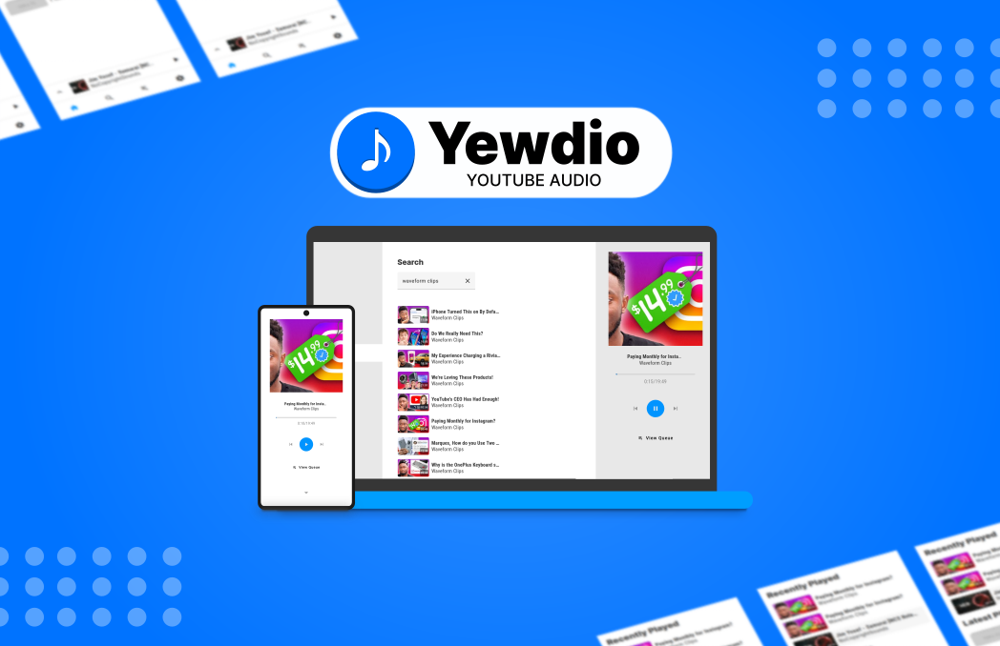

# Yewdio - <i>Youtube Audio</i>
### Listen to Youtube as audio in this web app.
https://yewdio.netlify.app

This is a work in progress ⚠️

#### Works
- Search for Youtube videos ✔️  
- Play them as Audio ✔️  
- Music player and controls ✔️  
- Add items to playlists ✔️  
- Add PWA support ✔️  
- Dark Mode ✔️  

#### To-Dos
- Edit Playlists ❌  
- Settings ❌  
- View the current queue ❌

and more visual improvements planned.

This is possible thanks to [Invidious](https://github.com/iv-org/invidious) API  

<b>Note:</b> The playlists are stored in browser's [localStorage](https://developer.mozilla.org/en-US/docs/Web/API/Window/localStorage)

###### This project was generated with [Angular CLI](https://github.com/angular/angular-cli) version 15.1.4.
